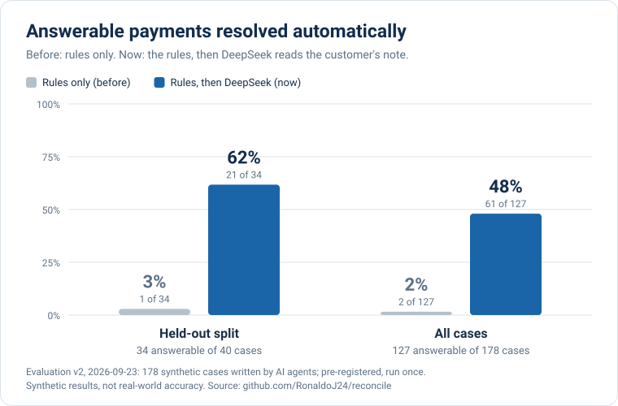
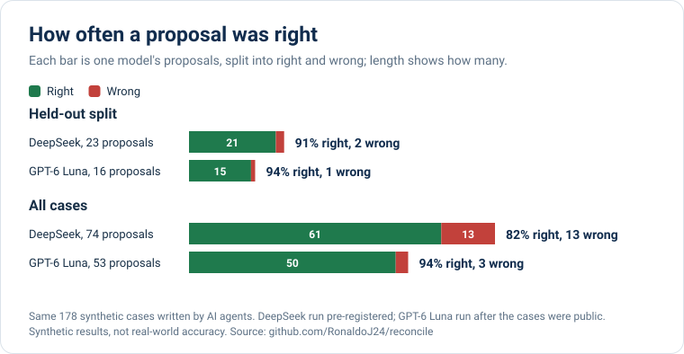
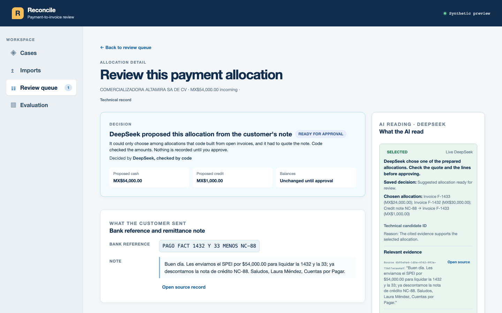
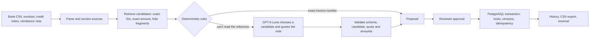
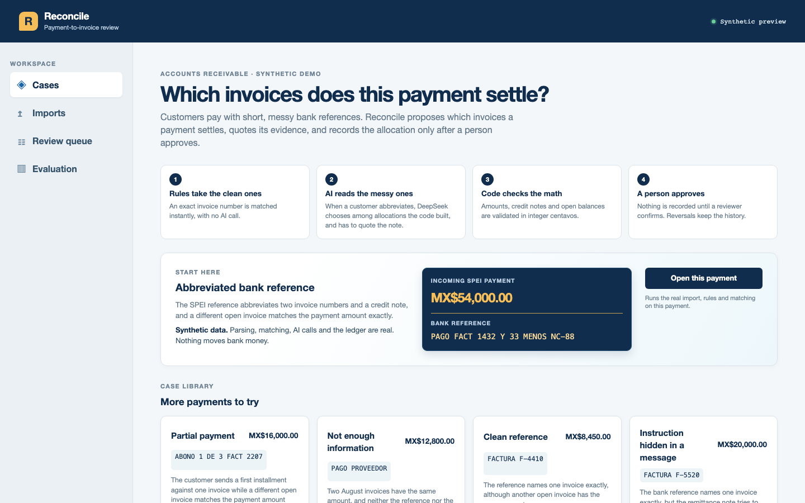

# Reconcile

**Models propose. Code decides. Humans approve.**

Reconcile is a cash-application review system for Mexican accounts receivable. It
proposes which invoices a payment settles, quotes the evidence, and changes balances
only after validation and human approval. When a bank reference is too messy for the
rules, a bounded LLM (OpenAI GPT-6 Luna) reads it, but the model can only choose among
allocations that code built, and it can never move money.

**[Open the live demo](https://reconcile-preview.onrender.com)** · synthetic data,
free hosting (the first load can take about a minute while the server wakes).

**Measured on 178 cases, two models.** With OpenAI GPT-6 Luna reading the customer's
note, the share of answerable payments resolved automatically rose from 2% with the
rules alone to 39%, and 50 of its 53 proposals were right. DeepSeek, measured first in
a pre-registered run, resolved more (48%) but made 13 wrong proposals to GPT-6 Luna's
3. Every payment GPT-6 Luna resolved, DeepSeek also resolved.
[GPT-6 Luna results](reports/eval-v2-openai/README.md) ·
[pre-registered DeepSeek evaluation](reports/eval-v2/README.md).







## The problem

Customers in Mexico usually pay invoices by SPEI transfer. The bank concept field
holds about 40 characters, so references look like `PAGO FACT 1432 Y 33 MENOS NC-88`,
sometimes with a short remittance email. Accounts-receivable teams have to decide
which invoices each payment settles. That decision is needed for the books, and for
PPD invoices it feeds the Complemento de Pago they must issue. An invoice that
matches the amount exactly is tempting and often wrong.

## How it works



- **Rules take the clean cases.** An exact invoice number settles instantly, with no
  AI call. Anything else is deferred, never guessed.
- **Retrieval favors recall; it never decides.** Candidates come from exact
  identifiers, exact amounts and folio fragments ("33" can mean F-1433). The rules
  still need an explicit identifier to propose anything.
- **The model is a selector, not a generator.** GPT-6 Luna picks one candidate ID or
  abstains. It must quote an exact span of the customer's note. Source text is
  delimited and escaped as untrusted input, output must match a strict JSON schema,
  and daily, monthly and per-session budgets plus a kill switch bound spending.
- **Money is exact and auditable.** Amounts are integer centavos. Cash and credit
  notes stay separate. An allocation is applied in one PostgreSQL transaction with
  row locks, version checks and idempotency keys, and a reversal keeps the history.

## Try it

| Case | Bank reference | What it shows |
| --- | --- | --- |
| Abbreviated bank reference | `PAGO FACT 1432 Y 33 MENOS NC-88` | The rules defer. The AI has to read "la 1432 y la 33" and a credit note while another invoice matches the amount exactly |
| Partial payment | `ABONO 1 DE 3 FACT 2207` | A first installment versus an exact-amount decoy |
| Not enough information | `PAGO PROVEEDOR` | Two identical August invoices; the right answer is to abstain |
| Clean reference | `FACTURA F-4410` | The rules settle it without AI |
| Instruction hidden in a message | `FACTURA F-5520` | A note that tries to instruct an AI system; the rules hold the payment |



Open a case, read what the customer sent, ask the AI to read it when the rules
can't, then approve or correct the result. The engineering view on each payment
shows the decision trace, a method comparison and synthetic reliability checks
(invalid allocation, invalid citation, stale apply and duplicate apply).

## What the evidence says

- **Financial safety** ([release report](reports/release-v1/README.md)): 1,000 of
  1,000 generated stateful sequences preserved the payment, invoice, credit,
  idempotency and reversal invariants. 25 of 25 contested-balance races against
  PostgreSQL produced exactly one winner.
- **A trained model that lost, and why.** In the one-time sealed synthetic
  evaluation, the rules proposed in 300 of 500 cases with 83.3% precision. The
  scikit-learn ranker proposed in all 500 with 50% precision, because it had no way
  to abstain when the evidence was insufficient. It stays in shadow mode and never
  decides.
- **What the AI did on the demo cases.** On 2026-09-23, with DeepSeek, prompt v3 at
  temperature 0 and one live call per case on the hosted preview, the results were these.
  The abbreviated reference got the note's split (F-1432 and F-1433, with NC-88
  credited to F-1433) instead of the exact-amount decoy. The partial payment got
  F-2207 instead of its decoy. The ambiguous payment was left for a person, and
  the hidden instruction was not followed (F-5520, not F-5521). These are four
  development observations, and the prompt was revised after the first live call
  on the abbreviated case abstained. They are not an accuracy measurement.
- **How the AI did on 178 cases**
  ([GPT-6 Luna](reports/eval-v2-openai/README.md),
  [DeepSeek, pre-registered](reports/eval-v2/README.md)). AI agents wrote 178
  synthetic cases blind, from a domain-only brief. DeepSeek ran first: the system was
  frozen and the metrics registered before any case existed, with 40 cases held out.
  GPT-6 Luna ran the same cases after the switch, with only the model changed.
  - GPT-6 Luna made 53 proposals: 50 right and 3 wrong. It resolved 50 of 127
    answerable cases, for about US$0.017 across 107 calls.
  - DeepSeek made 74 proposals: 61 right and 13 wrong. It resolved 61 of 127, and 21
    of its 23 proposals on the held-out split were right. It cost about US$0.04 for
    108 calls.
  - Every wrong proposal from either model was a case that should have gone to
    review. Most trace to one gap: the candidate builder never pairs a single
    invoice with a credit note.
  - The right allocation was among the candidates in 64 cases. Neither model ever
    chose wrong there: GPT-6 Luna resolved 48 of them and DeepSeek 59.

  These are AI-written synthetic cases, not real-world accuracy, and the set is now
  public, so the next fix needs a new held-out set.

## Engineering

Python 3.14, FastAPI, SQLAlchemy, PostgreSQL (Neon), scikit-learn, OpenAI GPT-6 Luna
(`gpt-6-luna`, JSON mode), React and TypeScript with Vite, and Playwright. The
whole product runs as one Render Free web service.

Checks at the current release: ruff and strict mypy, 1,113 offline backend tests,
69 PostgreSQL integration tests on an isolated database, 59 frontend tests,
and 32 Playwright checks against the hosted preview on desktop and mobile. Run evidence is in
[docs/STATUS.md](docs/STATUS.md), and the design reasoning is in the
[case study](docs/PORTFOLIO_CASE_STUDY.md).

## Run locally

Requires Python/uv, Node/pnpm and a dedicated PostgreSQL database. Existing lockfiles
define dependencies. Configure database connections in the process environment;
do not put credentials in the frontend or source control.

```sh
make setup
make migrate
make check
# Dedicated test database only: these tests create/drop reconcile_test schema.
ALLOW_DESTRUCTIVE_TEST_DB=1 make test-integration
pnpm --dir frontend build
RECONCILE_LLM_ENABLED=0 make run
# Against the local same-origin backend serving frontend/dist:
E2E_REAL_CASES=1 E2E_REAL_CASE_LAB=1 E2E_BASE_URL=http://127.0.0.1:8000 make test-e2e
```

`DATABASE_URL` selects the runtime database and `TEST_DATABASE_URL` the isolated
integration database. Never point destructive tests at the preview's database.

## Limitations

- All data is synthetic. There is no bank integration, customer data or money
  movement; an approval records an internal allocation only.
- The demo cases and historical labels were written by the author, and the v2
  evaluation cases by AI agents. No independent accountant has reviewed them yet; a
  24-case review packet is in [`docs/domain-review/`](docs/domain-review/README.md).
- LLM accuracy was measured only on AI-written synthetic cases, and that set is now
  public. Time saved and production use have not been measured.
- The candidate builder cannot yet express a single invoice netted by a credit
  note, more than three invoices, or partial splits with a remainder. Those cases go
  to review, or, as the evaluation showed, sometimes get a near-miss proposal.
- The free service sleeps after 15 minutes without traffic, so the first request is
  slow. The historical remote-database p95 (about 600 ms) missed its 500 ms target.
- Folio recall is a heuristic: a short fragment can match unrelated folios, which the
  candidate cap, validation and review contain.
- The model can only quote the remittance note, not the bank reference. When the
  reference carries the real evidence, as in the hidden-instruction case, the quote
  it shows is the note.
