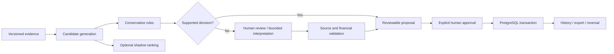

# Reconcile

**Which invoices does this payment actually settle?**

Reconcile helps a reviewer resolve incoming-payment allocation exceptions using
bank records, open invoices, credits and payment messages. It records approved
allocations and their reversals inside the application; it does not send money.

The [hosted synthetic preview](https://reconcile-preview.onrender.com) runs the
previous deployed version and may need time to wake. This branch is a local
enhancement under review, not a new deployment. Use synthetic data only.

## Start with a case

Open the bundled payment case from the local case library. It follows the real
parser, import and job pipeline, so you can inspect source text and the saved
decision trace. Five synthetic cases cover an explicit reference, a credit bundle
with a misleading amount match, conflicting instructions, insufficient evidence
and a prompt-like message. Reopening a case resumes its persisted state.

Compare methods on the saved input snapshot without applying an observation. The
local rules and unchanged ranker run; Direct and Hybrid remain unavailable without
authenticated recordings. The Evaluation page reads the preserved aggregate report
and distinguishes historical results from the unevaluated v2 protocol. See
[comparison and replay boundaries](docs/COMPARISON_AND_REPLAY.md).

The [case lab](docs/CASE_LAB.md) changes the active registered message while keeping
source and decision history. Its labeled synthetic checks exercise allocation,
citation, stale-request and duplicate-application controls through the real backend.

## The financial workflow

Open a registered case or import bounded CSV/TXT evidence, inspect a persisted
proposal, save any correction,
confirm the revision and its balance effects, then apply. Export application history
or explicitly reverse with a reason. Cash and credit stay separate throughout.



Interpretation cannot call the financial transaction. Revision/version checks,
workspace scoping, row locks and idempotency remain server responsibilities.

## What the AI evidence actually says

The scikit-learn ranker remains experimental and unpromoted. In the historical
sealed synthetic final evaluation, it proposed in 500/500 cases at 50% precision;
rules proposed in 300/500 at 83.3%. More coverage included unsupported allocations.
These are historical `rules-v1`/ranker results, not new-engine or real-world accuracy.
See [the preserved report](reports/release-v1/README.md) and
[evaluation implementation audit](docs/ENHANCEMENT_AUDIT.md).

DeepSeek Direct/Hybrid interpretation has bounded inputs, strict structured outputs,
exact citation checks, deterministic financial validation, quotas and explicit
failure states. Live inference is disabled for this work. A valid source slice does
not prove that it supports a recommendation. A raw ranker score is not confidence.
Missing usage, cost or execution evidence is not replaced with invented numbers.

The [case study](docs/PORTFOLIO_CASE_STUDY.md) explains the failed model experiment,
financial boundary, measurement limitations and the falsifiable next experiment.
The [v2 protocol](contracts/PORTFOLIO_V2.md) is frozen before new evaluation; its
existence does not mean a final or paid benchmark has run. The
[observation-only evaluator](docs/EVALUATION_V2.md) checks grouped splits, complete
allocations, outcome denominators, manifest binding and guarded final access. It
does not authenticate or execute provider observations.

## Run and verify locally

Requires Python/uv, Node/pnpm and a dedicated PostgreSQL database. Existing lockfiles
define dependencies. Configure database connections in the process environment;
do not put credentials in the frontend or source control.

```sh
make setup
make migrate
make check
# Dedicated test database only: these tests create/drop reconcile_test schema.
ALLOW_DESTRUCTIVE_TEST_DB=1 make test-integration
pnpm --dir frontend build
RECONCILE_LLM_ENABLED=0 make run
# Against the local same-origin backend serving frontend/dist:
E2E_REAL_CASES=1 E2E_REAL_CASE_LAB=1 E2E_BASE_URL=http://127.0.0.1:8000 make test-e2e
```

`DATABASE_URL` selects the runtime database; `TEST_DATABASE_URL` selects the isolated
integration database. Never point destructive tests at the preview's main database.
The real browser flow and unit tests serve different purposes; mock transport tests
do not establish persistence or locking. Current run evidence is in
[STATUS](docs/STATUS.md), with historical phases explicitly distinguished. The
[PR sequence](docs/PR_SEQUENCE.md) records the dependent draft review boundaries.

## Scope and limits

This is a synthetic portfolio/review system, not production finance software or an
accounting compliance claim. Labels have not been independently domain validated.
No customer adoption, time savings or real-world model accuracy has been measured.
Hosted cold-start/provider latency remains separate from local or matching-only
timing. The historical remote-database p95 missed its 500 ms target.

The existing stack is React/TypeScript, FastAPI, PostgreSQL, scikit-learn and a small
Python DeepSeek workflow. No new service, agent framework, runtime provider, paid
benchmark or deployment is required by this branch. The historical implementation
brief remains in [development documentation](docs/PROJECT_BRIEF.md).
