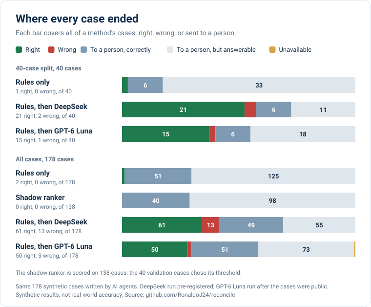
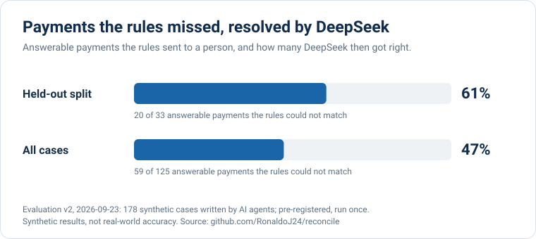
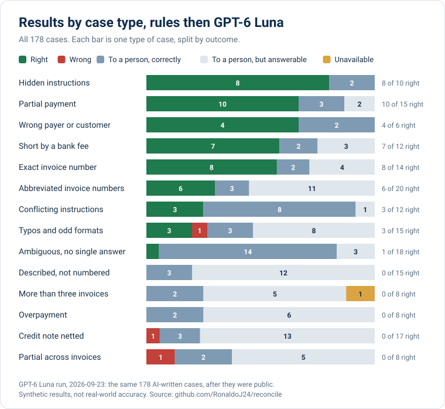
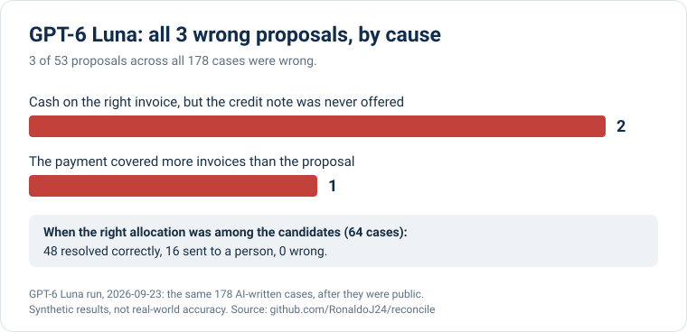

# GPT-6 Luna on the v2 cases

On 2026-09-23 the owner switched Reconcile's runtime model from DeepSeek
(`deepseek-flash`) to OpenAI GPT-6 Luna (`gpt-6-luna`). The same 178 cases from
[evaluation v2](../eval-v2/README.md) then ran once on the new model. Everything
except the provider was unchanged: rules, retrieval, candidates, prompt v3 and
validation. The run was frozen at `37dda8c`, and its plan was written before it
started, in [`PLAN.md`](PLAN.md).

In short: GPT-6 Luna made 3 wrong proposals where DeepSeek made 13, at less than
half the list-price cost. It resolved 50 payments where DeepSeek resolved 61. Every
payment GPT-6 Luna resolved, DeepSeek also resolved. GPT-6 Luna is the more careful
model: better when a wrong proposal is expensive, worse at taking work off a
reviewer.

These cases were public and DeepSeek's errors had been read before this run, so the
40-case "held-out" split is not held out for GPT-6 Luna. Nothing was tuned on the
cases. This is a model comparison on a known set, and the headline uses all 178
cases.

## At a glance










## Results

Every case ends one of four ways: a right proposal, a wrong proposal, a deferral to
a person, or unavailable. A deferral is correct when the case has no right answer
and a miss when an analyst could have answered it. Each row adds up to its case
count.

**All 178 cases** (127 answerable):

| Method | Proposed | Right | Wrong | Deferred correctly | Deferred but answerable | Unavailable | Answerable resolved | Value of wrong proposals |
| --- | ---: | ---: | ---: | ---: | ---: | ---: | ---: | ---: |
| Rules alone | 2 | 2 | 0 | 51 | 125 | 0 | 2 of 127 | MXN 0.00 |
| Rules, then DeepSeek | 74 | 61 | 13 | 49 | 55 | 0 | 61 of 127 | MXN 720,266.00 |
| **Rules, then GPT-6 Luna** | **53** | **50** | **3** | **51** | **73** | **1** | **50 of 127** | **MXN 164,968.00** |

**The same 40-case split** that was held out for DeepSeek (34 answerable):

| Method | Proposed | Right | Wrong | Deferred correctly | Deferred but answerable | Unavailable | Answerable resolved | Value of wrong proposals |
| --- | ---: | ---: | ---: | ---: | ---: | ---: | ---: | ---: |
| Rules alone | 1 | 1 | 0 | 6 | 33 | 0 | 1 of 34 | MXN 0.00 |
| Rules, then DeepSeek | 23 | 21 | 2 | 6 | 11 | 0 | 21 of 34 | MXN 102,906.00 |
| **Rules, then GPT-6 Luna** | **16** | **15** | **1** | **6** | **18** | **0** | **15 of 34** | **MXN 43,906.00** |

With 95% Wilson intervals, GPT-6 Luna's precision is 94.3% (84.6% to 98.1%) across
all cases, against DeepSeek's 82.4% (72.2% to 89.4%). It resolved 39.4% of answerable
cases (31.3% to 48.1%), against DeepSeek's 48.0% (39.5% to 56.7%). The shadow ranker
defers every case in both runs.

"Value of wrong proposals" counts the full payment of every wrong proposal, as
registered for v2. GPT-6 Luna's one error on the 40-case split put the cash on the
right invoice and missed only a credit note worth MXN 2,262.00.

## Paired comparison

Both models saw the same cases, so each case can be compared directly.

| DeepSeek | GPT-6 Luna | Cases |
| --- | --- | ---: |
| Right | Right | 50 |
| Right | Deferred | 11 |
| Wrong | Deferred | 10 |
| Wrong | Unavailable | 1 |
| Wrong | Wrong | 2 |
| Deferred | Wrong | 1 |
| Deferred | Deferred | 103 |

GPT-6 Luna never resolved a case that DeepSeek missed. It avoided 11 of DeepSeek's
13 errors and added one of its own. On the discordant pairs, an exact McNemar test
gives p = 0.001 for resolution (11 against 0) and p = 0.006 for wrong proposals (11
against 1). Treat these as exploratory: the cases are public and synthetic, and the
comparison was chosen after the DeepSeek results were known.

## Where the difference comes from

**Coverage it gave up.** GPT-6 Luna declined notes that describe invoices without
numbering them. It resolved none of the 15 "described, not numbered" cases, where
DeepSeek resolved 5. It also resolved no overpayments (DeepSeek: 3 of 8). It sent 34
cases it saw to review, against DeepSeek's 16, mostly citing insufficient evidence.

**Errors it avoided.** The credit-note cases produced 1 wrong proposal instead of 6.
The cases spanning more than three invoices produced none instead of 2, with one
unavailable. It also avoided DeepSeek's single errors on abbreviated invoice numbers,
conflicting instructions and a partial payment.

**Its three errors.**
- Two are the credit-note gap DeepSeek also hit: the candidate builder never pairs a
  single invoice with a credit note, so the cash went to the right invoice and the
  credit was missed (c064, c131).
- In c119 the note says "quedan la 58 y la 61 y a la 64 le abono 3 mil". The
  proposal covered only T-0058. The completeness check proposed after v2, deferring
  when the note names invoices the candidate leaves out, would catch it.

**One invalid response.** For c105, GPT-6 Luna's answer failed production validation.
It was recorded as unavailable, and the case stayed with a person.

**Within reach.** In the 64 answerable cases whose correct allocation was among the
candidates, GPT-6 Luna resolved 48 and sent 16 to review, with none wrong. DeepSeek
resolved 59 and sent 5 to review, also with none wrong.

## Cost and latency

- **GPT-6 Luna:** 107 recorded attempts, 101,539 input and 9,148 output tokens,
  about US$0.017 at list price. Uncached input is priced at the cache-write rate, so
  this is an upper bound; the billed amount was not observed. Median latency 1.51 s,
  p95 2.12 s.
- **DeepSeek:** 108 attempts, about US$0.038 at its peak list price. Median 1.05 s,
  p95 1.31 s.

GPT-6 Luna cost less than half as much per run and was about half a second slower
per call.

## What changed, and what this run cannot show

- Between `c4524a2` and `37dda8c`, `backend/src` changed only in the provider
  adapter, its configuration and rate card, the recording allowlist, the runner's
  key variable, the secret scan and the packaged results summary. The prompt, rules,
  retrieval, candidates and validation are the ones v2 measured.
- The cases are AI-written, synthetic, public, and their DeepSeek errors had been
  read. This is not a held-out result and not real-world accuracy.
- The prompt was written while DeepSeek was the model. It was not adapted to GPT-6
  Luna, which may have left coverage on the table.
- The PostgreSQL suite ran while this run prepared its cases. Two of its tests needed
  their expected reservation amounts updated for the new rate card, a test-only
  change after the freeze.

## Next steps

The next steps from v2 still apply, and GPT-6 Luna's errors point at the same
fixes:
1. Single-invoice credit-note candidates.
2. A completeness deferral.
3. A citable bank reference, which would help the 37 answerable cases that have no
   note.

Coverage on descriptive notes is the new question GPT-6 Luna raises. Any of these
changes needs a new, blind, held-out set before new numbers are claimed.

## Files and reproduction

- [`run/`](run/) holds the prepared inputs and labels, the rules and ranker
  observations, `direct.jsonl` with every recorded GPT-6 Luna call, `run.json`,
  `report.json`, `analysis.json` and the one-time ledger.
- `python3 reports/eval-v2/analyze.py reports/eval-v2-openai/run` regenerates the
  analysis, and `python3 reports/charts.py` redraws the charts.

Re-scoring a copy of `run/` without its ledger and report regenerates `report.json`
and the ledger byte for byte:

```sh
uv run python -m reconcile.ml.run_v2 score --out COPY
uv run python -m reconcile.ml.run_v2 score --out COPY --final
```
